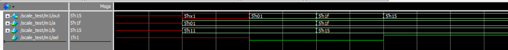

# 实验一 多路选择器

Copyright (c) 2020 Minaduki Shigure.  
专业：电子科学与技术  
学号：171180571  
姓名：吴康正

## 实验源码

使用一个简单的assign语句与条件运算符完成。

```v
module scale_mux(out, a, b, sel);

    parameter size = 1;

    output [size-1:0] out;
    input [size-1:0] a, b;
    input sel;

    assign out = sel ? b : a;

endmodule
```

## 测试代码

测试时定义mux宽度为5位进行验证。

```v
`define width 5
`timescale 1ns / 1ns
module scale_test;

    reg  [`width:1] a, b;
    wire [`width:1] out;
    reg sel;

// Instantiate the mux.  

    scale_mux #(`width) m1(.out(out), .a(a), .b(b), .sel(sel)); 

    initial
      begin 
	//  Display results to the screen
        $monitorb("%d out=%b a=%b b=%b sel=%b",$time,out,a,b,sel);
	//  Provide stimulus for the design
        #10 a = 5'b00001;
        b = 5'b10001;
         
	// Initialize (select a)
        #10 sel = 0;
	// Change the values of a and b (out still equals a)	 
        #10 a = 5'b11111;
        b = 5'b10101;
	// Change the value of sel (select b)
        #10 sel = 1;
	// Change the values of a and b (out still equals b)
        #10 a = 5'b11111;
        b = 5'b10101;	      
 	    
        #100 $finish;
      end

endmodule
```

## 测试结果

```plain
#                    0 out=xxxxx a=xxxxx b=xxxxx sel=x
#                   10 out=x0001 a=00001 b=10001 sel=x
#                   20 out=00001 a=00001 b=10001 sel=0
#                   30 out=11111 a=11111 b=10101 sel=0
#                   40 out=10101 a=11111 b=10101 sel=1
```



测试结果表明，模块设计正确，模块工作正常。
