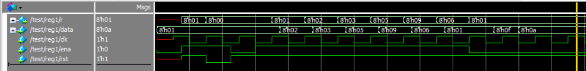

# 实验二 寄存器

Copyright (c) 2020 Minaduki Shigure.  
专业：电子科学与技术  
学号：171180571  
姓名：吴康正

## 实验源码

使用always块中的条件语句完成复位与使能的判断。

```v
module register(r, clk, data, ena, rst);
    output [7:0] r;
    input  [7:0] data;
    input        clk, ena, rst;
    reg    [7:0] r;

    always @ (posedge clk, rst)
    begin
        if (!rst)
        begin
            r <= 0;
        end
        else
        begin
            if (clk)
            begin
                if (ena)
                begin
                    r <= data;
                end
                else
                begin
                    r <= r;
                end
            end
        end
    end
  
endmodule
```

## 测试代码

测试时验证了复位、使能的有效性。

```v
module test;
    wire [7:0] reg_out;              //declare vector for register output
    reg  [7:0] data;
    reg        ena, rst;

    clock c1 (clk);      //clock oscilator
    register reg1 (.r(reg_out), .clk(clk), .data(data), .ena(ena), .rst(rst));

  
/*********************************************************************
  SPECIFY INPUT STIMULI 
*********************************************************************/

    initial 
    begin
	// initialize inputs
        data = 8'b1; ena = 0;

	// Output should be unknown
        #15 ena = 1; rst = 1;
        #15 rst = 0;
	                // test that reset works:Output should go to zero
		#15 ena = 0; rst = 1;
                    // test that enable works
        #15 ena = 1;
        #15 data = 8'b10;
        #20 data = 8'b11;
        #20 data = 8'b101;
        #20 data = 8'b1001;
        #20 data = 8'b110;
        #20 data = 8'b1;
        #15 ena = 0;
                      // Output should be clocked from data
        #15 data = 8'b1111;
        #15 data = 8'b1010;
                     // Output should not be clocked from data.
        #1000 $finish;
    end
    
    initial 
    begin
// SET UP THE OUTPUT FORMAT FOR THE TEXT DISPLAY
        $display("\t\t\t         INPUTS         OUTPUTS \n");
        $display("\t\t\t  RST   ENA   DATA  |  REG_OUT  ");
        $display("\t\t\t  ---   ---   ----  |  ----");
        $timeformat(-9, 1, " ns", 9); //Display time in nanoseconds
        $monitor ($time,"     %b     %b     %h   |     %h   ",
                           rst, ena, data, reg_out);

    end

endmodule
```

## 测试结果

```plain
#           			         INPUTS         OUTPUTS 
# 
# 		            	  RST   ENA   DATA  |  REG_OUT  
# 		            	  ---   ---   ----  |  ----
#                    0     x     0     01   |     xx   
#                   15     1     1     01   |     01   
#                   30     0     1     01   |     00   
#                   45     1     0     01   |     00   
#                   60     1     1     01   |     00   
#                   70     1     1     01   |     01   
#                   75     1     1     02   |     01   
#                   90     1     1     02   |     02   
#                   95     1     1     03   |     02   
#                  110     1     1     03   |     03   
#                  115     1     1     05   |     03   
#                  130     1     1     05   |     05   
#                  135     1     1     09   |     05   
#                  150     1     1     09   |     09   
#                  155     1     1     06   |     09   
#                  170     1     1     06   |     06   
#                  175     1     1     01   |     06   
#                  190     1     0     01   |     01   
#                  205     1     0     0f   |     01   
#                  220     1     0     0a   |     01  
```



测试结果表明，模块设计正确，各个功能工作正常。
