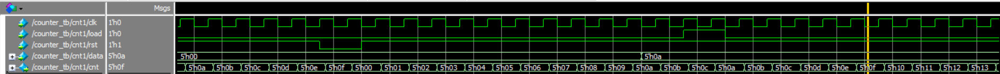

# 实验三 计数器

Copyright (c) 2020 Minaduki Shigure.  
专业：电子科学与技术  
学号：171180571  
姓名：吴康正

## 实验源码

这里在always块中没有使用非阻塞赋值，因为如果同时使用非阻塞赋值和延时赋值，可能会造成reset和load时产生混乱。

```v
module counter(
    input clk,
    input load,
    input rst,
    input [4:0] data,
    output reg [4:0] cnt
);

    always @ (posedge clk, rst)
    begin
        if (!rst)
        begin
            // 使用非阻塞赋值会导致reset时可能出现混乱
            cnt = #3 0;
            //cnt <= #3 0;
        end
        else
        begin
            if (clk)
            begin
                if (load)
                begin
                    cnt = #3 data;
                    //cnt <= #3 data;
                end
                else
                begin
                    cnt = #4 cnt + 1;
                    //cnt <= #4 cnt + 1;
                end
            end
        end
    end

endmodule
```

## 测试代码

先后测试了正常计数、复位、置位功能。

```v
module counter_tb;
    wire clk;
    reg load, rst;
    reg [4:0] data;
    wire [4:0] cnt;

    clock c1 (clk);
    counter cnt1 (.clk(clk), .load(load), .rst(rst), .data(data), .cnt(cnt));

    initial
    begin
        load = 0; data = 0; rst = 0;
        #30 rst = 1;
        #300 rst = 0;
        #30 rst = 1;
        #200 data = 10;
        #30 load = 1;
        #30 load = 0;
        #500 $finish;
    end

    initial 
    begin
// SET UP THE OUTPUT FORMAT FOR THE TEXT DISPLAY
        $display("\t\t\t         INPUTS         OUTPUTS \n");
        $display("\t\t\t  RST   LOAD   DATA  |  CNT_OUT  ");
        $display("\t\t\t  ---   ----   ----  |  ----");
        $timeformat(-9, 1, " ns", 9); //Display time in nanoseconds
        $monitor ($time,"     %b     %b      %h   |     %h   ",
                           rst, load, data, cnt);

    end

endmodule
```

## 测试结果

```plain
#           			         INPUTS         OUTPUTS 
# 
# 	             		  RST   LOAD   DATA  |  CNT_OUT  
# 	            		  ---   ----   ----  |  ----
#                    0     0     0      00   |     xx   
#                    3     0     0      00   |     00   
#                   30     1     0      00   |     00   
#                   54     1     0      00   |     01   
#                   74     1     0      00   |     02   
#                   94     1     0      00   |     03   
#                  114     1     0      00   |     04   
#                  134     1     0      00   |     05   
#                  154     1     0      00   |     06   
#                  174     1     0      00   |     07   
#                  194     1     0      00   |     08   
#                  214     1     0      00   |     09   
#                  234     1     0      00   |     0a   
#                  254     1     0      00   |     0b   
#                  274     1     0      00   |     0c   
#                  294     1     0      00   |     0d   
#                  314     1     0      00   |     0e   
#                  330     0     0      00   |     0e   
#                  334     0     0      00   |     0f   
#                  353     0     0      00   |     00   
#                  360     1     0      00   |     00   
#                  374     1     0      00   |     01   
#                  394     1     0      00   |     02   
#                  414     1     0      00   |     03   
#                  434     1     0      00   |     04   
#                  454     1     0      00   |     05   
#                  474     1     0      00   |     06   
#                  494     1     0      00   |     07   
#                  514     1     0      00   |     08   
#                  534     1     0      00   |     09   
#                  554     1     0      00   |     0a   
#                  560     1     0      0a   |     0a   
#                  574     1     0      0a   |     0b   
#                  590     1     1      0a   |     0b   
#                  594     1     1      0a   |     0c   
#                  613     1     1      0a   |     0a   
#                  620     1     0      0a   |     0a   
#                  634     1     0      0a   |     0b   
#                  654     1     0      0a   |     0c   
#                  674     1     0      0a   |     0d   
#                  694     1     0      0a   |     0e   
#                  714     1     0      0a   |     0f   
#                  734     1     0      0a   |     10   
#                  754     1     0      0a   |     11   
#                  774     1     0      0a   |     12   
#                  794     1     0      0a   |     13   
#                  814     1     0      0a   |     14   
#                  834     1     0      0a   |     15   
#                  854     1     0      0a   |     16   
#                  874     1     0      0a   |     17   
#                  894     1     0      0a   |     18   
#                  914     1     0      0a   |     19   
#                  934     1     0      0a   |     1a   
#                  954     1     0      0a   |     1b   
#                  974     1     0      0a   |     1c   
#                  994     1     0      0a   |     1d   
#                 1014     1     0      0a   |     1e   
#                 1034     1     0      0a   |     1f   
#                 1054     1     0      0a   |     00   
#                 1074     1     0      0a   |     01   
#                 1094     1     0      0a   |     02   
#                 1114     1     0      0a   |     03   
```



测试结果表明，模块设计正确，各个功能工作正常。
