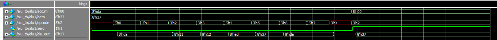

# 实验四 算术逻辑单元

Copyright (c) 2020 Minaduki Shigure.  
专业：电子科学与技术  
学号：171180571  
姓名：吴康正

## 实验源码

```v
module alu(
    input [7:0] accum,
    input [7:0] data,
    input [2:0] opcode,
    output reg zero,
    output reg [7:0] alu_out
);

parameter
    PASSACCUM0 = 3'b000,
    PASSACCUM1 = 3'b001,
    ADDOP = 3'b010,
    ANDOP = 3'b011,
    XOROP = 3'b100,
    PASSDATA = 3'b101,
    PASSACCUM2 = 3'b110,
    PASSACCUM3 = 3'b111;

parameter 
    op_delay = 3.5,
    zero_delay = 1.2;

always @ (accum or data or opcode)
begin
    case (opcode)
        PASSACCUM0 : alu_out <= #op_delay accum;
        PASSACCUM1 : alu_out <= #op_delay accum;
        ADDOP : alu_out <= #op_delay data + accum;
        ANDOP : alu_out <= #op_delay data & accum;
        XOROP : alu_out <= #op_delay data ^ accum;
        PASSDATA : alu_out <= #op_delay data;
        PASSACCUM2 : alu_out <= #op_delay accum;
        PASSACCUM3 : alu_out <= #op_delay accum;
        default: alu_out <= #op_delay 8'bxxxx_xxxx;
    endcase 
    zero <= #zero_delay (!accum);
end

endmodule
```

## 测试代码与结果

使用提供的测试代码进行测试。

```plain
# 			            INPUTS                       OUTPUTS 
# 
# 			  OPCODE   DATA IN    ACCUM IN  |  ALU OUT   ZERO BIT
# 			  ------   --------   --------  |  --------  --------
# PASS ACCUM OPERATION:      000     00110111   11011010  |  11011010      0
# PASS ACCUM OPERATION:      001     00110111   11011010  |  11011010      0
# ADD OPERATION       :      010     00110111   11011010  |  00010001      0
# AND OPERATION       :      011     00110111   11011010  |  00010010      0
# XOR OPERATION       :      100     00110111   11011010  |  11101101      0
# PASS DATA OPERATION :      101     00110111   11011010  |  00110111      0
# PASS ACCUM OPERATION:      110     00110111   11011010  |  11011010      0
# PASS ACCUM OPERATION:      111     00110111   11011010  |  11011010      0
# UNKNOWN OPERATION   :      00x     00110111   11011010  |  xxxxxxxx      0
# ADD OPERATION       :      010     00110111   00000000  |  00110111      1
# 
# No errors were found!
```



测试结果表明，模块设计正确，各个功能工作正常。
