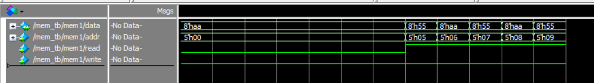

# 实验五 存储器

Copyright (c) 2020 Minaduki Shigure.  
专业：电子科学与技术  
学号：171180571  
姓名：吴康正

## 实验源码

```v
module mem(
    inout [7:0] data,
    input [4:0] addr,
    input read,
    input write
);

reg [7:0] memory [31:0];

always @ (posedge write)
begin
    memory[addr] = data;
end

assign data = read ? memory[addr] : 8'bzzzz_zzzz;

endmodule
```

## 测试代码与结果

使用提供的测试代码进行测试。

```plain
#    Setting all memory cells to zero...   0.0 ns
# 
#    Reading from one memory address...  64.0 ns
# 
#    Setting all memory cells to alternating patterns...  84.0 ns
# 
#    Doing block read from five memory addresses... 158.0 ns
# 
#    Completed Memory Tests With 0 Errors!
```

向内存中05-09地址写入的时序图：

读取05-09地址内存时的时序图：


测试结果表明，模块设计正确，各个功能工作正常。
