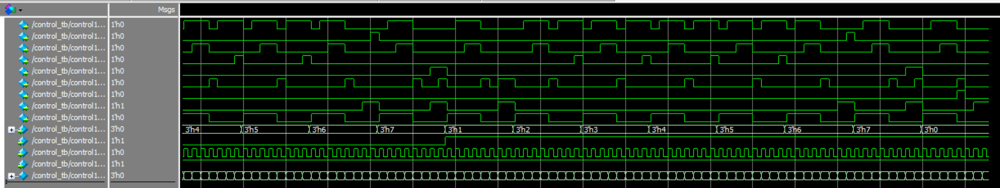

# 实验六 控制器

Copyright (c) 2020 Minaduki Shigure.  
专业：电子科学与技术  
学号：171180571  
姓名：吴康正

## 实验源码

```v
module control(
    output reg rd,
    output reg wr,
    output reg ld_ir,
    output reg ld_acc,
    output reg ld_pc,
    output reg inc_pc,
    output reg halt,
    output reg data_e,
    output reg sel,
    input [2:0] opcode,
    input zero,
    input clock,
    input reset
);

parameter 
    HLT = 3'b000,
    SKZ = 3'b001,
    ADD = 3'b010,
    AND = 3'b011,
    XOR = 3'b100,
    LDA = 3'b101,
    STO = 3'b110,
    JMP = 3'b111;

reg [2:0] state;

always @ (posedge clock or negedge reset)
begin
    if (!reset)
    begin
        state <= 3'b000;
        {rd, wr, ld_ir, ld_acc, ld_pc, inc_pc, halt, data_e, sel} <= 9'b0;
    end
    else
    begin
        case (state)
            3'b000:
            begin
                state <= 3'b001;
                {rd, wr, ld_ir, ld_acc, ld_pc, inc_pc, halt, data_e, sel} <= 9'b0_0000_0001;
            end
            3'b001:
            begin
                state <= 3'b010;
                {rd, wr, ld_ir, ld_acc, ld_pc, inc_pc, halt, data_e, sel} <= 9'b1_0000_0001;
            end 
            3'b010:
            begin
                state <= 3'b011;
                {rd, wr, ld_ir, ld_acc, ld_pc, inc_pc, halt, data_e, sel} <= 9'b1_0100_0001;
            end 
            3'b011:
            begin
                state <= 3'b100;
                {rd, wr, ld_ir, ld_acc, ld_pc, inc_pc, halt, data_e, sel} <= 9'b1_0100_0001;
            end 
            3'b100:
            begin
                state <= 3'b101;
                if (opcode == HLT) begin
                    {rd, wr, ld_ir, ld_acc, ld_pc, inc_pc, halt, data_e, sel} <= 9'b0_0000_1100;
                end else begin
                    {rd, wr, ld_ir, ld_acc, ld_pc, inc_pc, halt, data_e, sel} <= 9'b0_0000_1000;
                end
            end 
            3'b101:
            begin
                state <= 3'b110;
                if (opcode == ADD || opcode == AND || opcode == XOR || opcode == LDA) begin
                    {rd, wr, ld_ir, ld_acc, ld_pc, inc_pc, halt, data_e, sel} <= 9'b1_0000_0000;
                end else begin
                    {rd, wr, ld_ir, ld_acc, ld_pc, inc_pc, halt, data_e, sel} <= 9'b0_0000_0000;
                end
            end 
            3'b110:
            begin
                state <= 3'b111;
                if (opcode == SKZ && zero) begin
                    {rd, wr, ld_ir, ld_acc, ld_pc, inc_pc, halt, data_e, sel} <= 9'b0_0000_1010;
                end else begin
                    if (opcode == ADD || opcode == AND || opcode == XOR || opcode == LDA) begin
                        {rd, wr, ld_ir, ld_acc, ld_pc, inc_pc, halt, data_e, sel} <= 9'b1_0000_0000;
                    end else begin
                        if (opcode == JMP) begin
                            {rd, wr, ld_ir, ld_acc, ld_pc, inc_pc, halt, data_e, sel} <= 9'b0_0001_0010;
                        end else begin
                            {rd, wr, ld_ir, ld_acc, ld_pc, inc_pc, halt, data_e, sel} <= 9'b0_0000_0010;
                        end
                    end
                end
            end
            3'b111:
            begin
                state <= 3'b000;
                if (opcode == SKZ && zero) begin
                    {rd, wr, ld_ir, ld_acc, ld_pc, inc_pc, halt, data_e, sel} <= 9'b0_0000_1010;
                end else begin
                    if (opcode == ADD || opcode == AND || opcode == XOR || opcode == LDA) begin
                        {rd, wr, ld_ir, ld_acc, ld_pc, inc_pc, halt, data_e, sel} <= 9'b1_0010_0000;
                    end else begin
                        if (opcode == STO) begin
                            {rd, wr, ld_ir, ld_acc, ld_pc, inc_pc, halt, data_e, sel} <= 9'b0_1000_0010;
                        end else begin
                            if (opcode == JMP) begin
                                {rd, wr, ld_ir, ld_acc, ld_pc, inc_pc, halt, data_e, sel} <= 9'b0_0001_1010;
                            end else begin
                                {rd, wr, ld_ir, ld_acc, ld_pc, inc_pc, halt, data_e, sel} <= 9'b0_0000_0010;
                            end
                        end
                    end
                end
            end 
            // default: 
        endcase 
    end
end

endmodule
```

## 测试代码与结果

使用提供的测试代码进行测试。

```plain
# *** REACHED END OF TEST VECTORS ***
# 
# There were 0 errors detected!
# 
# ** Note: $finish    : control_tb.v(74)
```



测试结果表明，模块设计正确，各个功能工作正常。
